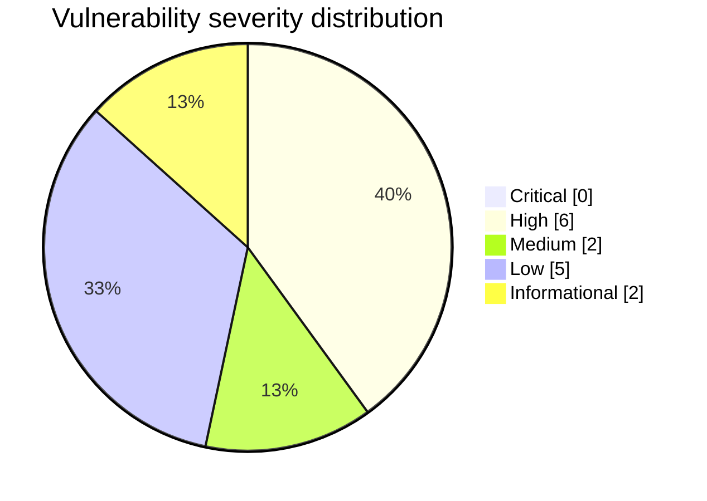
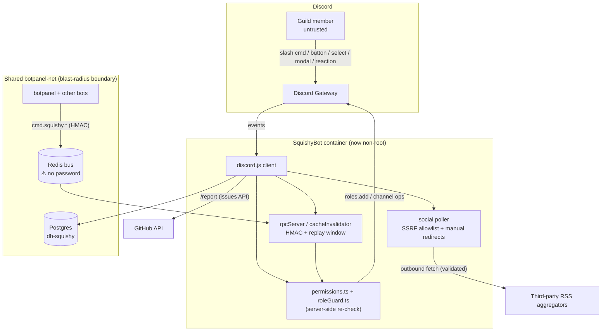

# SquishyBot — Security & Optimization Review

**Repository:** `jason-tucker/squishybot`
**Reviewed commit (base):** `1fbb135` (main)
**Remediation branch:** `claude/stoic-cannon-11exy5`
**Date:** 2026-06-09
**Reviewer:** automated multi-agent security review (4 parallel research agents + coordinator)

> Scope note: SquishyBot is a **single-guild Discord bot** (discord.js v14, Drizzle/Postgres,
> ioredis, zod). It is **not** an internet-facing HTTP service — no web frontend, no public REST
> API, no multi-tenancy, and **no LLM / RAG / agent / tool-calling code** (see
> `AI_SAFETY_REVIEW.md`). The threat model therefore centres on four real trust boundaries:
> (1) Discord interactions (a guild member is the untrusted actor), (2) a Redis HMAC-signed RPC
> command bus from an external "botpanel" service, (3) an outbound RSS social-feed fetcher
> (SSRF surface), and (4) the Docker/compose + GitHub Actions deploy pipeline.

---

## Executive summary

| | |
|---|---|
| **Overall pre-review risk** | **Medium-High** — two High-severity in-guild privilege-escalation paths reachable by any member / any Redis-network peer, plus a High-severity event-loop DoS via a hostile RSS feed. |
| **Overall post-review risk** | **Low-Medium** — all member-reachable escalation and DoS paths fixed; residual items are infra/ops hardening (Redis auth on the shared bus, schema-push strategy) that need operator action, not code. |
| **Confirmed findings** | 15 (0 Critical, **6 High**, 2 Medium, 5 Low, 2 Info) |
| **Fixed in this branch** | 12 findings (11 in the original PR + **H5** migration cutover) |
| **Documented for manual action** | 3 (server-side half of H6, L2 SHA-pinning, I1 job-split) |
| **Verification** | `pnpm typecheck` green after every commit; ReDoS fix proven by benchmark; SSRF redirect behaviour proven against a local server. No runtime e2e possible (a Discord bot needs a live token + guild; repo has no test framework). |
| **Safe to deploy?** | **Yes** to staging/prod from this branch *after* a normal review — all changes are behaviour-preserving. The DB-password hardening (M2) is a **non-breaking app-layer startup warning** (the weak `squishybot_dev` compose fallback is retained so existing deploys aren't broken); the container now runs as non-root (writes only stdout + DB). No DB migration. See `DEPLOYMENT_AND_ROLLBACK.md`. |

### Biggest issues fixed
1. **H1 — `/color` arbitrary-role self-grant** (any member → any bot-manageable role, incl. staff).
2. **H2 — `rxnroles.create` arbitrary-role self-assignment** (Redis-network peer → reaction-role privesc).
3. **H3 — RSS parser ReDoS** (one hostile feed froze the single-threaded bot for minutes).
4. **H4 — production container ran as root.**
5. **M1 — RSS SSRF allowlist bypassed by redirects.**

### Biggest residual risks (need operator action)
- **H6 (server side)** — Redis on the shared `botpanel-net` has no password; the HMAC secret is the *only* barrier to the privileged RPC bus. Enable `requirepass` + an authenticated `REDIS_URL`.

### Also fixed (follow-up)
6. **H5 — `drizzle-kit push --force` at every boot** (could silently drop columns/data). Replaced with a committed-migration runner: a generated baseline, a forward-only fail-closed startup migrate, a `pg_dump` pre-deploy backup gate, and a self-baseline guard for the legacy push-built DB. See `H5_MIGRATION_CUTOVER.md`.

---

## Findings register

| ID | Sev | Conf | Category (CWE) | Location | Evidence | Impact | Fix | Status |
|----|-----|------|----------------|----------|----------|--------|-----|--------|
| **H1** | High | High | Privesc / IDOR (CWE-639) | `src/commands/color.ts:61` (pre-fix) | `member.roles.add(picked)` where `picked = interaction.values[0]`, never checked against the configured set | Any member submits `color:pick` with any role id → self-grants any bot-manageable role incl. staff | Validate `picked` ∈ configured color roles **and** passes `isAssignableRole`; re-check feature flag | ✅ Fixed (`de7fe55`) |
| **H2** | High | High | Privesc (CWE-269) | `src/services/rpc/handlers/rxnroles/create.ts:90`; sink `src/bot/events/messageReaction.ts:42` | mapping `roleId` validated for snowflake *shape* only; reaction grant sink added it unconditionally | Redis-network peer wires a reaction to a privileged role → self-assign by reacting | `checkAssignableRole` at create (`bad-role`) **and** at the grant sink | ✅ Fixed (`de7fe55`) |
| **H3** | High | High | ReDoS / DoS (CWE-1333/400) | `src/services/social/rssParser.ts:24` (pre-fix) | lazy regex `/<item\b[^>]*>([\s\S]*?)<\/item>/gi` backtracks O(n²) on unclosed `<item>` opens | Hostile feed `"<item>".repeat(N)` within 5 MB cap pins the event loop for minutes → whole bot frozen | Linear `indexOf` block scan, capped at 500 items | ✅ Fixed (`c44c627`) |
| **H4** | High | High | Insecure default (CWE-250) | `Dockerfile` (no `USER`) | `node:24-alpine` defaults to uid 0; entrypoint + bot ran as root | RCE / malicious dependency executes as root on the shared docker network | `USER node` before `ENTRYPOINT` | ✅ Fixed (`a185988`) |
| **H5** | High | High | Data-loss (CWE-665) | `scripts/docker-entrypoint.sh:4-9` (pre-fix) | `drizzle-kit push --force` at every boot; `--force` auto-approves column drops | A schema diff (refactor / watchtower auto-deploy) silently drops columns + data, unattended, no backup | Committed-migration runner (generated baseline + forward-only fail-closed `migrate()`), `pg_dump` pre-deploy backup gate, self-baseline guard for the legacy DB | ✅ Fixed (see `H5_MIGRATION_CUTOVER.md`) |
| **H6** | High | Med | Missing auth (CWE-306) | `docker-compose.yml` (`REDIS_URL` no password, external `botpanel-net`) | password-less Redis is the sole gate for all privileged RPC verbs | Any container on the shared network that learns the HMAC secret (or replays/eavesdrops) drives privileged verbs | Code: startup warning + docs. **Server side: enable `requirepass` (manual)** | 🟡 Partially fixed (`3acb434`, `240a1e0`) + manual |
| **M1** | Med | High | SSRF (CWE-918) | `src/services/social/poller.ts:129` (pre-fix) | `redirect:'follow'` — undici chases 3xx without re-running `assertSafeOutboundUrl` | Public feed 302→`169.254.169.254`/`localhost`/docker `db`/`redis` bypasses the allowlist | Manual redirect (≤5 hops), re-validate every hop, `redirect:'manual'` | ✅ Fixed (`c44c627`) |
| **M2** | Med | High | Weak credential (CWE-1392/258) | `docker-compose.yml:18,42` | `${POSTGRES_PASSWORD:-squishybot_dev}` weak fallback | DB on shared net comes up with a guessable password if the var is unset | Non-breaking startup warning in `config/env.ts` when the weak default is detected (fallback retained so existing deploys don't break); operator sets a strong value | ✅ Fixed (`a185988`, softened to non-breaking) |
| **L1** | Low | High | Info leak (CWE-532) | `src/services/logger.ts:23` (pre-fix) | `BOTPANEL_RPC_SECRET` not in `SECRET_PATTERNS` | An error wrapping the HMAC secret could reach `LOG_CHANNEL_ID` / owner DM | Added to redaction list | ✅ Fixed (`240a1e0`) |
| **L2** | Low | High | Supply chain (CWE-1104) | `.github/workflows/deploy.yml` | 3rd-party actions on floating tags (`appleboy/ssh-action@v1.2.0`, `docker/*`) | A retagged/compromised action runs in the SSH-key-holding deploy job | **Documented** — pin to commit SHAs (API blocked here) | 🔶 Manual |
| **L3** | Low | High | Vuln dep (CVE-2026-45736) | `pnpm-lock.yaml` (`ws@8.20.0`) | `pnpm audit` moderate via `discord.js > @discordjs/ws > ws` | Uninitialized-memory disclosure on `ws.close(code, TypedArray)` | pnpm override `ws@^8.20.1` → resolves 8.21.0 | ✅ Fixed (`d8aed0e`) |
| **L4** | Low | High | Replay (CWE-294) | `src/services/cacheInvalidator.ts` (pre-fix) | HMAC-only; no timestamp window | Captured invalidate message replayed indefinitely → repeated DB reloads | ±30s window (mirrors rpcServer) | ✅ Fixed (`3acb434`) |
| **L5** | Low | High | Config hygiene | `.env.example` (pre-fix) | `BOTPANEL_RPC_SECRET` / `REDIS_URL` undocumented | Operators don't know the bus is off / how to secure Redis | Documented both with security guidance | ✅ Fixed (`240a1e0`) |
| **I1** | Info | High | Least privilege | `.github/workflows/deploy.yml:24` | `packages: write` granted to whole job incl. PR runs | Broader-than-needed token in PR-triggered runs | Top-level `permissions: contents: read`; job-split documented | 🟡 Partially fixed (`1dba7fb`) + manual |
| **I2** | Info | High | Disclosure | `src/services/rpc/handlers/meta.ts` | `meta.*` returns full roster to any bus peer | Reconnaissance feeding H2/H6 | Covered by securing the bus (H6) | 🔶 Manual (depends on H6) |

### Verified CLEAN (actively checked, not findings)
- **No committed secrets** anywhere in git history (`git log --all -p` sweep) — only placeholders. `.env` is gitignored and untracked; `.dockerignore` excludes it from the image.
- **SQL injection:** all queries use Drizzle parameterized `sql` tagged templates; no `sql.raw`, no string-concatenated queries.
- **Command injection:** no `exec`/`spawn`/`eval`/`Function`/`vm` in `src/`; shell scripts are operator-run with `set -Eeuo pipefail` and quote only operator/env vars.
- **XXE / billion-laughs:** the RSS parser is regex/`indexOf`-based — there is **no XML/DOM parser, no DTD/entity resolution**. Structurally impossible.
- **`/report` → GitHub:** API URL built from the `GITHUB_REPO` env var, not user input; user text goes in the JSON body via `JSON.stringify`; errors are not verbosely leaked; review gated on `isBotOwner`.
- **HMAC mechanics:** correct timing-safe compare, ±30s replay window + nonce cache, fail-closed when the secret is unset.
- **Discord interaction authz (rest of):** every voice/sudo/staff/report/profile/games handler re-checks ownership/sudo/owner against the **DB record**, not the customId. No other IDOR found.

---

## Severity distribution

---

## System / data-flow diagram

See `THREAT_MODEL.md` for trust boundaries, attack paths, and blast radius;
`REMEDIATION_PLAN.md` for the fix order and residual-risk tracking.
